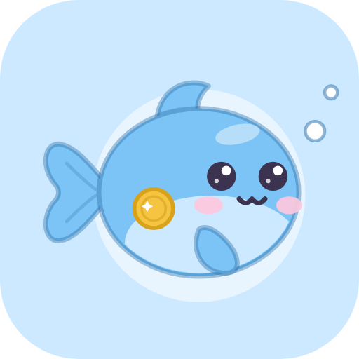
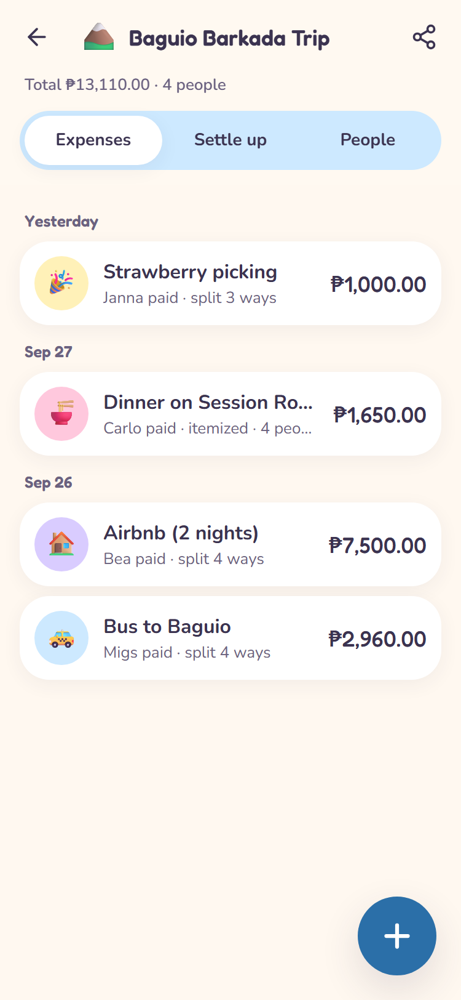
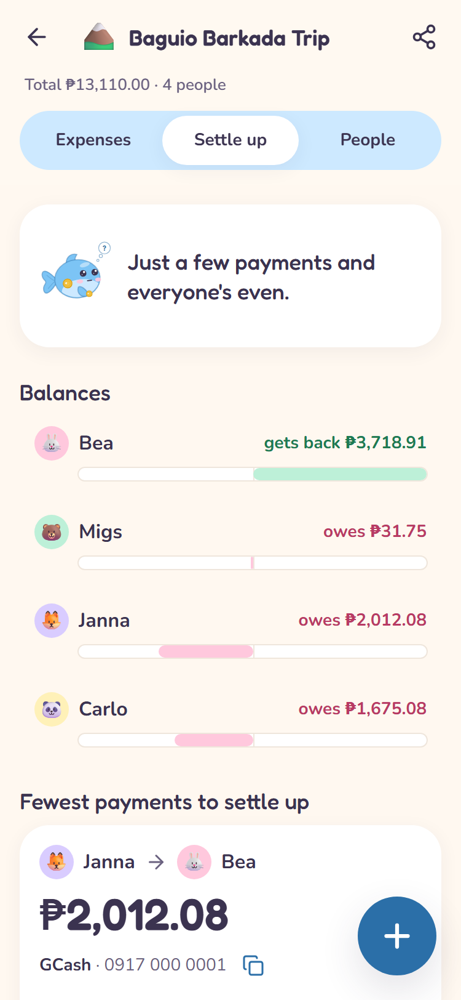
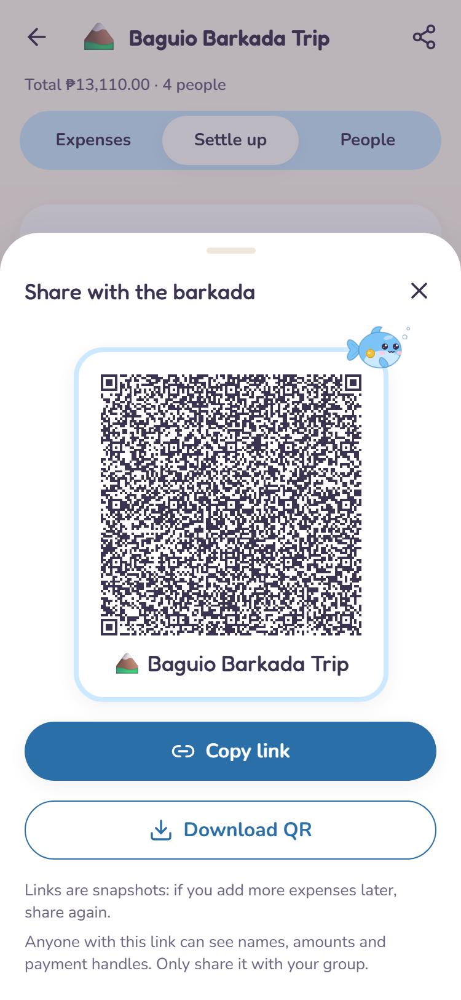
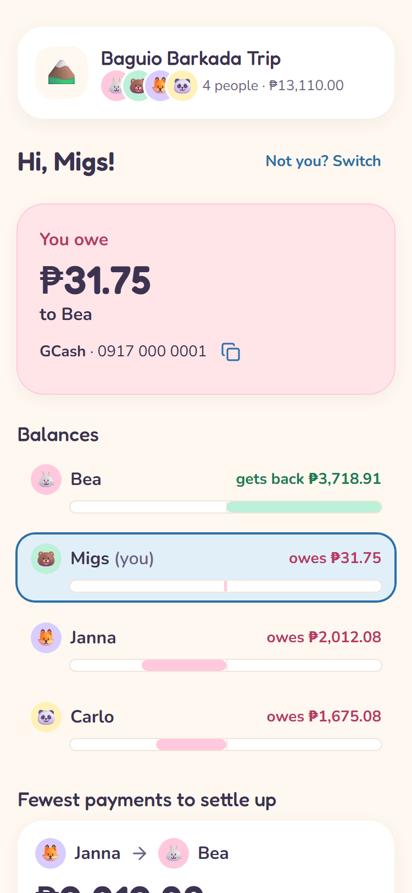
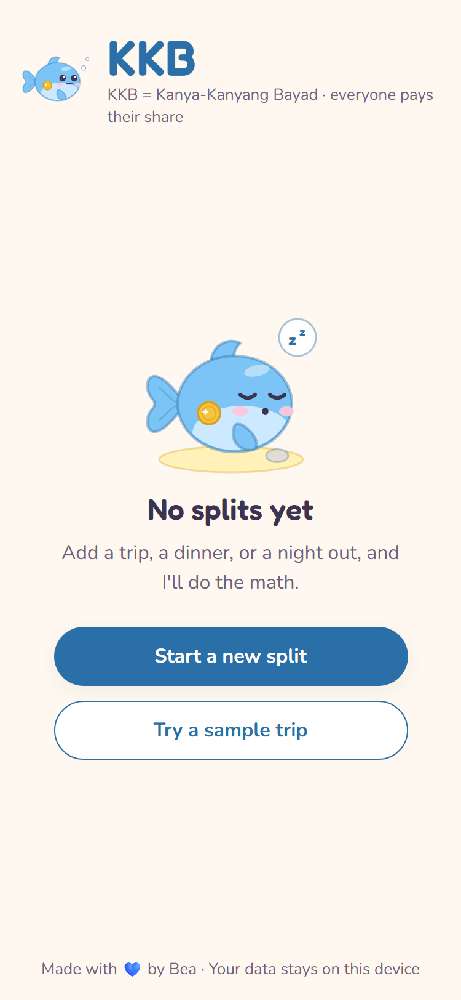
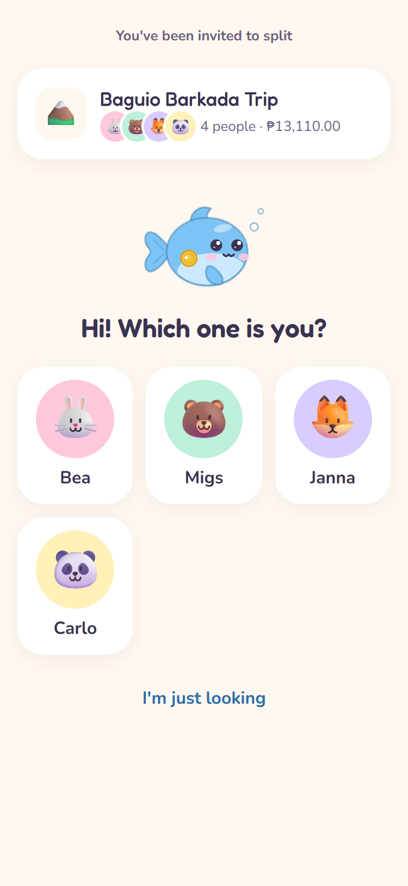
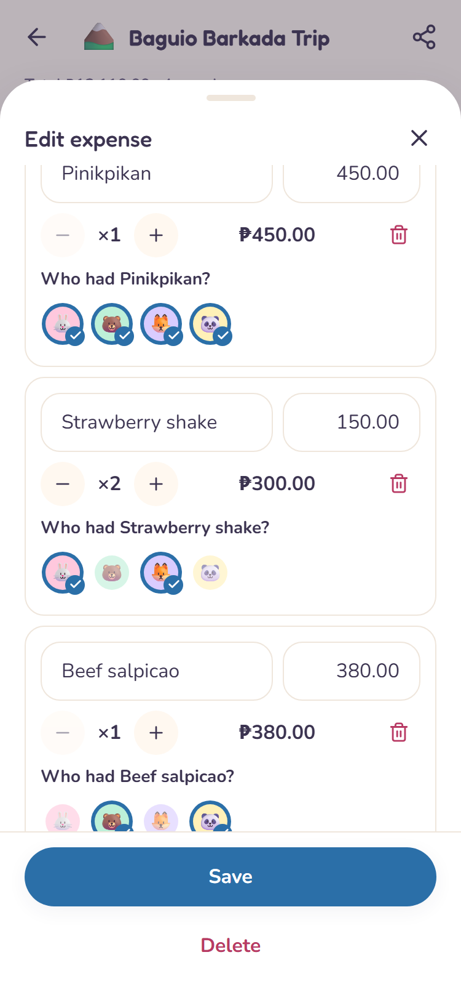

<div align="center">



# KKB

**Kanya-Kanyang Bayad, made easy.**

A cute bill splitter for barkadas. Add what everyone paid, and KKB tells you who owes whom
in the fewest possible payments. No sign-up, no server: share a link or a QR code.

[**Live demo →**](https://beapoquiz.github.io/kkb/) &nbsp;·&nbsp; tap **"Try a sample trip"** to see a full example

[](https://github.com/beapoquiz/kkb/actions/workflows/ci.yml)

</div>

<p align="center">
  
  
  
  
</p>

## Why KKB?

_Kanya-Kanyang Bayad_ is what every Filipino friend group (barkada) says when everyone pays for
their own share. It sounds simple until the trip is over: one person booked the Airbnb, another
paid for the bus, dinner had a 10% service charge, and not everyone had the ube cheesecake.

KKB does that math for you, down to the centavo, and turns a messy pile of receipts into a short
list like _"Migs → Bea ₱420"_. The goal is that someone at a restaurant table can open it, add
the bill and know who owes whom in under a minute, one-handed.

## Meet Plutus 🐟

Plutus is the mascot, and he is based on my real pet: a little blue fish called Plutus, named
after the Greek god of wealth (fitting for a money app). In KKB he's the calm friend who does the
math so nobody has to feel awkward asking for money. He has one gold coin-shaped scale as his
"wealth" mark and four moods: happy, thinking (while debts are left), celebrating (all settled)
and sleepy (empty screens). He's an original inline-SVG drawing, and every mood respects
`prefers-reduced-motion`.

<p align="center">
  
  
  
</p>

## Features

- **Events for trips, dinners and nights out**, each with its own emoji and currency
  (PHP, USD, EUR, JPY, SGD, KRW).
- **Equal splits** with exact remainders: ₱1,000 between 3 people is ₱333.34 / ₱333.33 / ₱333.33.
- **Itemized receipts**: tap who had each dish, add a service charge (a `10%` chip, the common
  rate in PH restaurants), tip or senior/PWD discount, and see a live "who pays what" preview with a
  receipt-total check.
- **Settle up in the fewest payments**, with each person's balance, payment handles (GCash, Maya,
  bank) with a copy button, and **Mark as paid** (with undo). Confetti when everyone is even:
  _"All settled! Bayad na lahat 🎉"_.
- **Share without a server**: a link or QR code that opens a _"Who are you?"_ screen and a personal
  view (_"You owe Bea ₱420"_). Friends can save the split to their own device.
- **Copy a summary for the group chat**, or **save it as an image**.
- **Spending by category**, delete with undo, and **works offline** as an installable PWA.
- **Accessible**: keyboard-friendly, focus-trapped sheets that close on Esc or the back button,
  labelled controls, and colors checked against WCAG AA.

## How settle-up works

Every expense is turned into per-person shares, and each person gets a **balance**:

```
balance = paid for the group − own share + payments sent − payments received
```

A positive balance means you get money back and a negative one means you owe. The balances always
add up to exactly zero (the tests assert this for hundreds of random events).

To turn balances into transfers, KKB uses a **greedy** algorithm: repeatedly match the person who
owes the most with the person who is owed the most, and move the smaller of the two amounts. Every
round brings at least one person to zero, so a group of _n_ people never needs more than
_n − 1_ transfers. Ties are broken by the order people were added, so the result is always the same.

**Example:** A is owed ₱50, B is owed ₱30, and C and D each owe ₱40.

| Round | Largest debtor | Largest creditor | Transfer  | Left over           |
| ----- | -------------- | ---------------- | --------- | ------------------- |
| 1     | C (−40)        | A (+50)          | C → A ₱40 | A +10, B +30, D −40 |
| 2     | D (−40)        | B (+30)          | D → B ₱30 | A +10, D −10        |
| 3     | D (−10)        | A (+10)          | D → A ₱10 | everyone at 0       |

**Why not the true minimum?** Finding the fewest possible transfers is **NP-hard**: it amounts to
splitting people into as many groups as possible whose balances each sum to zero (every such group
saves one transfer), which is a close cousin of the subset-sum problem. The greedy approach runs
instantly, is easy to explain, never needs more than _n − 1_ transfers, and for real friend groups
it usually lands on the minimum or one transfer away from it. That's the right trade-off for an app
you use at a dinner table.

### Money is never a float

All amounts are stored as **integer minor units** (centavos; yen and won have none). Input like
`"₱1,200.50"` is parsed from its digits, never with `parseFloat(x) * 100`. Service charge, tip and
discount are spread across people with the **largest remainder method** (using `BigInt`
internally), so every share adds up exactly to the total. The math lives in pure TypeScript in
[`src/lib`](src/lib) and is covered by unit tests, a fixture with pre-calculated results
([`docs/06-sample-trip.md`](docs/06-sample-trip.md)) and property-based tests
([fast-check](https://fast-check.dev/)).

## How sharing works with no server

There is no backend and no account. The whole split travels **inside the link**:

1. The event is converted to a compact JSON form (short keys, people referenced by position).
2. It is compressed with [lz-string](https://github.com/pieroxy/lz-string) into a URL-safe string.
3. It goes into the URL hash: `https://beapoquiz.github.io/kkb/#/s/<data>`. The sample trip is
   about 830 characters, small enough for a QR code (links over 2,000 characters show a
   "share the link instead" note).

When someone opens a link, it is treated as **untrusted input**: it is size-checked, decompressed,
and validated with [Zod](https://zod.dev) (max 30 people, 300 expenses, string lengths, integer
amounts, and every reference must point to a real person) before anything is shown. Totals are
always recomputed and never read from the link.

> **Privacy note:** links are **snapshots**. Changes don't sync live, so re-share after you
> update a split. Anyone with the link can see names, amounts and payment handles, so only share it
> with your group. Everything else stays in your browser's local storage, and the app makes no
> network requests: no analytics, trackers, CDNs or external fonts.

## Tech stack

|         |                                                                                                                                                                                                               |
| ------- | ------------------------------------------------------------------------------------------------------------------------------------------------------------------------------------------------------------- |
| App     | [React](https://react.dev) + [TypeScript](https://www.typescriptlang.org) (strict), [Vite](https://vite.dev)                                                                                                  |
| Styling | [Tailwind CSS](https://tailwindcss.com) with design tokens, [Framer Motion](https://motion.dev), self-hosted Nunito & Fredoka                                                                                 |
| State   | [Zustand](https://zustand.docs.pmnd.rs) with a safe `localStorage` persistence layer and schema migrations                                                                                                    |
| Data    | [Zod](https://zod.dev) schemas as the single source of types, [lz-string](https://github.com/pieroxy/lz-string), [qrcode](https://github.com/soldair/node-qrcode)                                             |
| Extras  | [canvas-confetti](https://github.com/catdad/canvas-confetti), [html-to-image](https://github.com/bubkoo/html-to-image), [vite-plugin-pwa](https://vite-pwa-org.netlify.app)                                   |
| Testing | [Vitest](https://vitest.dev), [React Testing Library](https://testing-library.com), [fast-check](https://fast-check.dev), [Playwright](https://playwright.dev) + [axe](https://github.com/dequelabs/axe-core) |
| CI/CD   | GitHub Actions: lint, typecheck, test and build on every push; deploy to GitHub Pages from `main`                                                                                                             |

## Running locally

You need [Node.js](https://nodejs.org) 20 or newer.

```bash
npm install
npm run dev        # http://localhost:5173/kkb/
```

Other scripts:

```bash
npm run build      # type-check and build to dist/
npm run preview    # serve the production build at http://localhost:4173/kkb/
npm run lint       # ESLint (zero warnings allowed)
npm run typecheck  # TypeScript, strict
npm run format     # Prettier
```

## Running tests

```bash
npm test               # 140 unit and component tests (Vitest)
npm run test:coverage  # coverage for src/lib (about 99% of lines)
npx playwright install chromium   # once, for the end-to-end tests
npm run test:e2e       # Playwright smoke tests + axe accessibility checks
npm run screenshots    # regenerate docs/screenshots (and the demo video)
npm run assets         # regenerate the icons and Open Graph image from the Plutus component
```

The end-to-end smoke test runs the whole story against the production build: load the sample trip,
add an equal and an itemized expense, mark a transfer as paid, open the share link in a fresh
browser as Migs and check the personal view. It also checks offline support, the back button, and
a broken link. A short recording of the main flow is in
[`docs/screenshots/demo.webm`](docs/screenshots/demo.webm).

## Project structure

```
src/
├── lib/          Pure TypeScript domain logic (no React): money, splitting, balances,
│                 settle-up, share links, summaries, schemas. Tests live next to each file.
├── store/        Zustand store, safe storage + migrations, toasts, "who are you" identity
├── components/   Shared UI: buttons, avatar chips, sheets, toasts, fields…
├── screens/      Routes: home, create, event (expenses / settle up / people), shared link
├── mascot/       Plutus as SVG parts, one component with four moods
└── styles/       Design tokens and Tailwind setup
e2e/              Playwright smoke test, screenshots and demo video
docs/             The planning docs this was built from, plus screenshots
scripts/          Icon and Open Graph image generator
```

The [`docs/`](docs) folder holds the product spec, design system, data model and acceptance
checklist written before any code; [`NOTES.md`](NOTES.md) records the decisions made along the
way.

## License

[MIT](LICENSE) © 2026 Bea Juliana Poquiz
